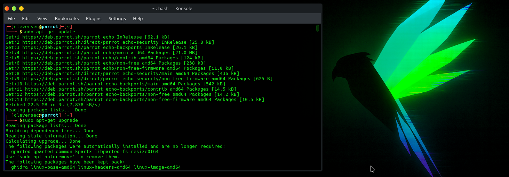

# Detection Engineering Home Lab: Zeek + Elastic Security


A self-built detection home lab simulating a real SOC visibility stack — network sensor, endpoint agent, and SIEM.

**Outcome:** Working Zeek + Elastic + Sysmon pipeline validated end-to-end across
network and endpoint layers.

**Note:** This is the foundation phase. Part 2 (attack simulation + custom detection
rules) builds directly on this lab — see [What's Next](#whats-next).

## Table of Contents
- [Project Overview](#project-overview)
- [Architecture](#architecture)
- [Implementation](#implementation)
- [Results](#results)
- [What's Next](#whats-next)

## Project Overview

### Objective
Build a working detection engineering home lab from scratch — provision the VMs, instrument the network layer and endpoint layer, and validate that both feed a SIEM correctly — to build first-hand intuition for how the alerts gets generated.

### Key Components
- **Zeek** — Network traffic analysis and protocol-level logging
- **Elastic Security (Hosted)** — SIEM, log aggregation, and endpoint detection
- **Elastic Defend** — Endpoint protection and alerting
- **Sysmon** — Granular Windows process/registry telemetry
- **VMware Workstation Pro** — Lab virtualization

### Tech Stack
| Component | Technology | Version |
|---|---|---|
| Network IDS | Zeek | 8.0 |
| SIEM | Elastic Security (Hosted Deployment) | 9.x |
| Endpoint Agent | Elastic Agent | 9.4.2 |
| Endpoint Telemetry | Sysmon (Sysinternals) | Latest |
| Network Sensor OS | Ubuntu | 24.04 |
| Attack Simulation OS | Parrot OS | Latest |
| Target OS | Windows | 11 |
| Hypervisor | VMware Workstation Pro | Latest |

## Architecture
┌──────────────────┐

│   Parrot OS      │  ← Generates network activity (Nmap)

└────────┬─────────┘

│ Scan traffic

▼

┌──────────────────┐         ┌──────────────────┐

│  Ubuntu (Zeek)   │ ──────▶ │ Elastic Security  │

│  Network Sensor  │  logs   │  (Hosted SIEM)    │

└──────────────────┘         └────────▲─────────┘

│ Agent + Sysmon

┌────────┴─────────┐

│   Windows 11      │

│  (Target/Endpoint)│

└──────────────────┘


**Data Flow:**
1. Parrot OS generates network activity (Nmap scan) against the Windows target
2. Zeek on Ubuntu observes traffic on the segment, logs connection metadata in JSON
3. Elastic Agent + Sysmon on Windows capture process execution and auth events
4. Both sources ship to Elastic Security (Hosted), correlated in Discover and Alerts

---

## Implementation

### Part 1: Virtual Lab Provisioning

Three VMs on an isolated NAT segment — Ubuntu (Zeek sensor), Parrot OS (attack
simulation), Windows 11 (target).


*ParrotOS Specs.png — 8GB RAM, 8 cores, NAT-isolated*


*Windows 11 specs.png*


*Ubuntu specs.png*

Updated and upgraded both Linux distros before installing any tooling.


*parrot_update_upgrade.png*

#### Challenge 1: Two OS, Neither Could Reach Windows

**Issue:** Both Linux hosts failed to ping the Windows 11 VM.


*parrot_problem_unable to ping windows.png*


*ubuntu_problem_unable to ping windows.png*

**Analysis:** Tested Linux-to-Linux connectivity first to isolate the variable —
if Parrot could reach Ubuntu, the problem was specific to Windows, not the network.


*ubuntu_ping_parrot.png — confirms the segment itself was healthy*

It was. Windows Defender Firewall blocks inbound ICMP by default.

**Resolution:**
```powershell
New-NetFirewallRule -DisplayName "Allow ICMPv4-In" -Protocol ICMPv4 -IcmpType 8 -Action Allow
```


*windows_solution_unable to ping.png*

**Outcome:** Bidirectional ping confirmed across all three hosts.


*windows_can ping both OS.png*


*ubuntu_ping works after windows solution.png*

#### Disabling Windows Defender (Deliberate)

Later phases involve tooling that Defender will correctly flag as malicious. To keep
Elastic Defend and Sysmon as the detection surface being tested — rather than
Defender intercepting activity invisibly upstream — Defender was disabled via Group
Policy and verified.


*windows_disable defender_gpedit.png*


*windows_disable defender_gpedit_realtimeprotection.png*


*windows_disabled defender after applying gpo.png*

---

### Part 2: Network Sensor Deployment (Zeek)

```bash
su root
echo 'deb https://download.opensuse.org/repositories/security:/zeek/xUbuntu_24.04/ /' | sudo tee /etc/apt/sources.list.d/security:zeek.list
curl -fsSL https://download.opensuse.org/repositories/security:zeek/xUbuntu_24.04/Release.key | gpg --dearmor | sudo tee /etc/apt/trusted.gpg.d/security_zeek.gpg > /dev/null
sudo apt update
sudo apt install zeek-8.0
```

#### Challenge 2: Missing Dependency

**Issue:** `curl` not installed by default on minimal Ubuntu, blocking the GPG key fetch.


*ubuntu_problem_curl is not installed.png*

**Resolution:** `apt install curl`
**Outcome:** Repository added, Zeek installed cleanly.

#### Zeek Configuration

`networks.cfg` — declared `192.168.125.0/8` as local so Zeek classifies lab traffic
correctly instead of flagging it as unknown.


*ubuntu_zeek configuration_networks cfg.png*

`node.cfg` — corrected the listening interface from the template default (`eth0`) to
the actual adapter (`ens33`), confirmed via `ip addr`.


*ubuntu_zeek configuration.png*

#### Challenge 3: ZeekControl Not in PATH

**Issue:** `zeekctl: command not found`


*ubuntu_problem_zeek not found.png*

**Resolution:** Ran directly from the install path instead.
```bash
cd /opt/zeek/bin
./zeekctl
deploy
```


*ubuntu_solution_zeek not found.png*

**Outcome:** Zeek deployed and running. Snapshotted all three VMs as a clean baseline
before introducing Elastic.

---

### Part 3: SIEM Deployment (Elastic Security)

#### Challenge 4: Wrong Deployment Architecture

This was the one that nearly ended the project.

**Issue:** Elastic trial defaulted into a **serverless** deployment. No Elastic Agent
installer was available for the Windows target — serverless doesn't expose agent
management the way a self-managed stack does. I didn't know that going in; all I had
was a dead end that didn't match any documentation I could find.


*elastic_create serverless.png*

**Analysis:** This wasn't a missing command — it was the wrong deployment model
entirely for what I needed.

**Resolution:** Switched to **Hosted Deployment** with Elastic Defend.


*elastic_add elastic defend.png*


*elastic_welcome.png*

**Outcome:** Agent installer immediately available; deployment unblocked.

#### Elastic Agent Installation (Windows Target)

```powershell
$ProgressPreference = 'SilentlyContinue'
Invoke-WebRequest -Uri https://artifacts.elastic.co/downloads/beats/elastic-agent/elastic-agent-9.4.2-windows-x86_64.zip -OutFile elastic-agent-9.4.2-windows-x86_64.zip
Expand-Archive .\elastic-agent-9.4.2-windows-x86_64.zip -DestinationPath .
cd elastic-agent-9.4.2-windows-x86_64
.\elastic-agent.exe install --url=https://<fleet-url>:443 --enrollment-token=<token>
```


*elastic_install agent on your host.png*


*windows_installed elastic agent.png*


*elastic_agent confirmed.png*

#### Challenge 5: Agent Enrolled, No Data Flow

**Issue:** Fleet showed *"Listening for incoming data from enrolled agents…"* with
nothing arriving after 5+ minutes.


*elastic_problem_no incoming data.png*

**Analysis:** Checked agent status directly, generated fresh event activity, restarted
the agent service to force a new handshake. Every check came back healthy — which
ruled out the agent itself and pointed somewhere else.

**Resolution:** Outbound firewall rules were silently blocking ports **443**
(HTTPS) and **8220** (Fleet Server) — the agent could enroll but not sustain the data
channel.

**Outcome:** Logs began flowing within seconds of opening 443/8220 outbound.

#### Detection Tuning: Prevent → Detect

Switched Malware, Ransomware, Memory Threat, and Malicious Behavior protections from
**Prevent** to **Detect** — same logic as the Defender decision earlier. Automatic
blocking removes the activity before it can be observed.


*elastic_endpoint setting_from prevent to detect.png*

---

### Part 4: Zeek → Elastic Integration

#### Challenge 6: Deprecated Documentation

**Issue:** Official docs pointed to `@load policy/tuning/json-logs.zeek`, which
depends on a `defaults` policy folder that no longer exists in Zeek 8.0 — it was
folded into Zeek's own defaults, and the docs hadn't caught up.

**Resolution:** Used the underlying config variable directly in `local.zeek`:
