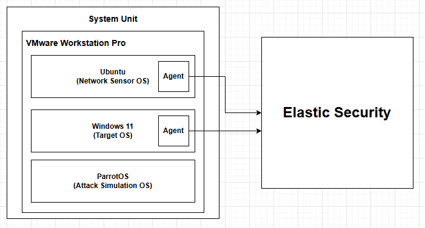
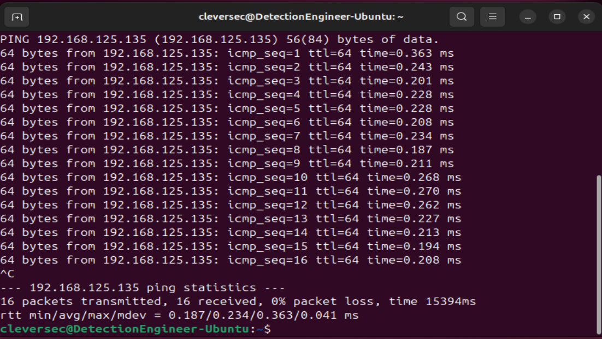
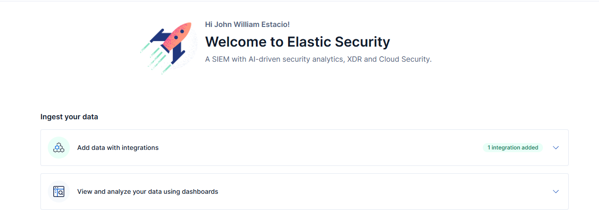

# Detection Engineering Home Lab: Zeek + Elastic Security


A detection home lab used to validate end-to-end visibility from network traffic to endpoint process execution.

**Outcome:** Working Zeek + Elastic + Sysmon pipeline, validated across network and
endpoint layers.

**Note:** This is the foundation phase. Part 2 (attack simulation + custom detection
rules) builds on this range — see [What's Next](#whats-next).

---

## Table of Contents

- [Project Overview](#project-overview)
- [Architecture](#architecture)
- [Implementation](#implementation)
- [Results](#results)
- [What's Next](#whats-next)

---

## Project Overview

### Objective

Build a detection engineering home lab — network visibility, SIEM, endpoint
telemetry — from a blank set of VMs, and validate that each layer correctly
generates and ships data to the SIEM.

### Key Components

- **Zeek** - Network traffic analysis and protocol-level logging
- **Elastic Security (Hosted)** - SIEM, log aggregation, and endpoint detection
- **Elastic Defend** - Endpoint protection and alerting
- **Sysmon** - Granular Windows process and registry telemetry

### Tech Stack

| Component | Technology | Version |
|-----------|-----------|---------|
| Network IDS | Zeek | 8.0 |
| SIEM | Elastic Security (Hosted) | 9.x |
| Endpoint Agent | Elastic Agent | 9.4.2 |
| Endpoint Telemetry | Sysmon (Sysinternals) | Latest |
| Network Sensor OS | Ubuntu | 24.04 |
| Attack Simulation OS | Parrot OS | Latest |
| Target OS | Windows | 11 |
| Hypervisor | VMware Workstation Pro | Latest |

---

## Architecture


**Data Flow:**
1. Parrot OS generates network activity (Nmap scan) against the Windows target
2. Zeek on Ubuntu observes traffic on the segment, logs connection metadata in JSON
3. Elastic Agent + Sysmon on Windows capture process execution and auth events
4. Both sources ship to Elastic Security (Hosted), correlated in Discover and Alerts

---

## Implementation

### Part 1: Range Provisioning

Three VMs on an isolated NAT segment — Ubuntu (Zeek sensor), Parrot OS (attack
simulation), Windows 11 (target).

Updated and upgraded both Linux distros before installing any tooling.

#### Challenge 1: Cross-OS Connectivity

**Issue:** Both Linux hosts failed to ping the Windows 11 VM.


**Analysis:** Tested Linux-to-Linux connectivity first to isolate the variable.



Linux-to-Linux succeeded, narrowing the issue to the Windows host. Windows Defender
Firewall blocks inbound ICMP by default.

**Resolution:**
```powershell
New-NetFirewallRule -DisplayName "Allow ICMPv4-In" -Protocol ICMPv4 -IcmpType 8 -Action Allow
```


**Outcome:** Bidirectional ping confirmed across all three hosts.


#### Defender Configuration

Later phases use tooling that Defender flags as malicious by default. To keep
Elastic Defend and Sysmon as the detection surface under test, Defender was disabled
via Group Policy and the change verified.

---

### Part 2: Network Sensor Deployment (Zeek)

```bash
su root
echo 'deb https://download.opensuse.org/repositories/security:/zeek/xUbuntu_24.04/ /' | sudo tee /etc/apt/sources.list.d/security:zeek.list
curl -fsSL https://download.opensuse.org/repositories/security:zeek/xUbuntu_24.04/Release.key | gpg --dearmor | sudo tee /etc/apt/trusted.gpg.d/security_zeek.gpg > /dev/null
sudo apt update
sudo apt install zeek-8.0
```

#### Challenge 2: Missing Dependency

**Issue:** `curl` not installed by default on minimal Ubuntu, blocking the GPG key fetch.


**Resolution:** `apt install curl`
**Outcome:** Repository added, Zeek installed.

#### Zeek Configuration

`networks.cfg` — declared `192.168.125.0/8` as local so Zeek classifies lab traffic
correctly instead of treating it as unknown.


`node.cfg` — corrected the listening interface from the template default (`eth0`) to
the actual adapter (`ens33`), confirmed via `ip addr`.


#### Challenge 3: ZeekControl Not in PATH

**Issue:** `zeekctl: command not found`


**Resolution:** Binary existed but wasn't symlinked to PATH. Ran directly from the
install location:
```bash
cd /opt/zeek/bin
./zeekctl
deploy
```


**Outcome:** Zeek deployed and running. Snapshotted all three VMs as a baseline
before introducing Elastic.

---

### Part 3: SIEM Deployment (Elastic Security)

#### Challenge 4: Deployment Architecture

**Issue:** Elastic trial defaulted to a **serverless** deployment. No Elastic Agent
installer was available for the Windows target.


**Analysis:** Serverless does not expose agent management the way a self-managed
deployment does — the deployment model itself didn't fit a single-host agent use
case.

**Resolution:** Switched to **Hosted Deployment** with Elastic Defend (full SIEM +
endpoint protection).




**Outcome:** Agent installer available; deployment unblocked.

#### Elastic Agent Installation (Windows Target)

```powershell
$ProgressPreference = 'SilentlyContinue'
Invoke-WebRequest -Uri https://artifacts.elastic.co/downloads/beats/elastic-agent/elastic-agent-9.4.2-windows-x86_64.zip -OutFile elastic-agent-9.4.2-windows-x86_64.zip
Expand-Archive .\elastic-agent-9.4.2-windows-x86_64.zip -DestinationPath .
cd elastic-agent-9.4.2-windows-x86_64
.\elastic-agent.exe install --url=https://<fleet-url>:443 --enrollment-token=<token>
```


#### Challenge 5: Agent Enrolled, No Data Flow

**Issue:** Fleet showed *"Listening for incoming data from enrolled agents…"* with
no data after 5+ minutes.


**Analysis:** Checked agent status (`elastic-agent.exe status`), generated fresh
event activity, restarted the agent service to force a new handshake. All checks
returned healthy, ruling out the agent itself.

**Resolution:** Outbound firewall rules were blocking ports **443** (HTTPS) and
**8220** (Fleet Server) — the agent could complete enrollment but not sustain the
data channel.

**Outcome:** Logs flowed within seconds of opening 443/8220 outbound.

#### Detection Tuning: Prevent → Detect

Switched Malware, Ransomware, Memory Threat, and Malicious Behavior protections from
**Prevent** to **Detect**, consistent with the earlier Defender configuration —
automatic blocking removes the activity before it can be observed.


---

### Part 4: Zeek → Elastic Integration

#### Challenge 6: Deprecated Documentation

**Issue:** Official docs referenced `@load policy/tuning/json-logs.zeek`, which
depends on a `defaults` policy folder not present in Zeek 8.0.

**Analysis:** The package was deprecated upstream and folded into Zeek's own
defaults; the documented path no longer applies.

**Resolution:** Used the underlying config variable directly in `local.zeek`: redef LogAscii::use_json = T;

**Outcome:** Verified `conn.log` under `/opt/zeek/logs/current` returning valid JSON.


Created a dedicated Zeek integration policy in Elastic (`DEB_x86_64`, matching the
Ubuntu sensor architecture) and confirmed enrollment.


---

### Part 5: Pipeline Validation — Network Layer

```bash
sudo nmap -sV 192.168.125.136
```


Confirmed via Elastic's Zeek Log Overview dashboard (traffic spikes matching the scan
window) and independently in Discover using `event.dataset:zeek.connection`.


---

### Part 6: Pipeline Validation — Endpoint Layer

Downloaded Palo Alto's `wildfire-test-pe-file.exe`, a benign EICAR-class detection
test file, on the Windows target.


Triggered a **Critical** alert, risk score 99, with a full process tree:
`userinit.exe → explorer.exe → wildfire-test-pe-file.exe → conhost.exe`


Ran reconnaissance-style PowerShell commands (`whoami`, `hostname`,
`Get-ComputerInfo`, `ipconfig`, `Get-ComputerInfo > systeminformation.txt`) and
traced the parent-child chain via `process.parent.name: "powershell.exe"`.


---

### Part 7: Endpoint Telemetry — Sysmon

#### Challenge 7: Endpoint Telemetry Depth

**Issue:** Elastic Defend provided alert-level detail but limited granularity at the
process/registry level.

**Analysis:** Defend reports that an event occurred; it does not provide the
process/registry detail needed to reconstruct how it occurred.

**Resolution:** Installed Sysmon (Sysinternals) with a community config, added the
Windows integration in Elastic, and re-ran the same EICAR + PowerShell sequence for a
before/after comparison.

**Outcome:** 553 records returned, 100% attributed to `windows.sysmon_operational`,
versus a handful of Defend alerts for the same activity.


---

## Results

### Validation Summary

| Layer | Tool | Validation Method | Result |
|-------|------|-------------------|--------|
| Network | Zeek | Nmap scan + Zeek Log Overview dashboard | Traffic correlated, JSON logs confirmed |
| Endpoint (Alert) | Elastic Defend | EICAR-class test file | Critical alert, risk score 99, full process tree |
| Endpoint (Process) | Elastic Defend + Discover | `process.name` / `process.parent.name` queries | Individual + chained PowerShell activity confirmed |
| Endpoint (Depth) | Sysmon | Identical sequence, before/after comparison | 553 records vs. handful of alert-level events |

### From Zero to Working Range

| Area | Before | After |
|------|--------|-------|
| SIEM deployment experience | None | Hosted Elastic Security, agent fleet, integration policies |
| Network visibility | None | Zeek sensor, verified JSON logging, dashboard correlation |
| Endpoint visibility | None | Elastic Defend alerting + Sysmon process-level telemetry |
| Troubleshooting approach | N/A | Firewall/network ruled out before application config, on every blocker |

---

## What's Next

This home lab is the foundation for a second phase:

- [ ] Run adversary simulation chains (Atomic Red Team) against the range
- [ ] Write and tune custom KQL detection rules against the Zeek + Sysmon data
- [ ] Map validated techniques to MITRE ATT&CK (T1046, T1059, and beyond)
- [ ] Add Suricata alongside Zeek for signature-based detection
- [ ] Build a unified Kibana dashboard combining Zeek, Sysmon, and Defend
- [ ] Document full attack → detection → response chains

---

## 📝 Challenges Resolved

**Challenge 1: Network Connectivity**
- **Issue:** Windows Defender Firewall blocking inbound ICMP
- **Analysis:** Isolated Linux-to-Linux connectivity first to rule out a network-wide issue
- **Resolution:** Explicit inbound firewall rule
- **Outcome:** Bidirectional ping confirmed across all hosts

**Challenge 2: Missing Dependency**
- **Issue:** `curl` absent on minimal Ubuntu install
- **Analysis:** Repo setup failing at the GPG key fetch step
- **Resolution:** Single package install
- **Outcome:** Zeek repo configured

**Challenge 3: PATH Configuration**
- **Issue:** `zeekctl` not found
- **Analysis:** Binary existed but wasn't symlinked to PATH
- **Resolution:** Ran from the install directory
- **Outcome:** Zeek deployed and running

**Challenge 4: Deployment Architecture Mismatch**
- **Issue:** Serverless deployment had no path to agent installation
- **Analysis:** Deployment model did not support a single-host agent use case
- **Resolution:** Switched to Hosted Deployment
- **Outcome:** Agent install unblocked

**Challenge 5: Silent Data Flow Failure**
- **Issue:** Agent enrolled but shipped no data
- **Analysis:** Ruled out the agent/service via status checks before suspecting the network
- **Resolution:** Opened outbound 443/8220
- **Outcome:** Data flowing within seconds

**Challenge 6: Deprecated Documentation**
- **Issue:** Official docs referenced a removed Zeek policy path
- **Analysis:** Package deprecated upstream, docs not updated
- **Resolution:** Used the underlying config variable directly
- **Outcome:** Valid JSON logging confirmed

**Challenge 7: Insufficient Endpoint Granularity**
- **Issue:** Elastic Defend alone left a visibility gap at the process level
- **Analysis:** Alert-level detail insufficient for process-level investigation
- **Resolution:** Added Sysmon, re-ran identical test sequence
- **Outcome:** 553 records vs. a handful of alerts for the same activity

---

## License

MIT License - See [LICENSE](/License) file for details

---

## Contact

**LinkedIn:** https://www.linkedin.com/in/johnwilliamestacio/
**Email:** johnwilliamestacio@gmail.com

**Questions?** Open an issue or reach out directly.

---

## Acknowledgments

**Tech Stack Credits:**
- [Zeek](https://zeek.org/)
- [Elastic Security](https://www.elastic.co/security)
- [Sysinternals (Sysmon)](https://learn.microsoft.com/en-us/sysinternals/downloads/sysmon)
- [VMware](https://www.vmware.com/)

---

**If you found this helpful, please give it a ⭐**
